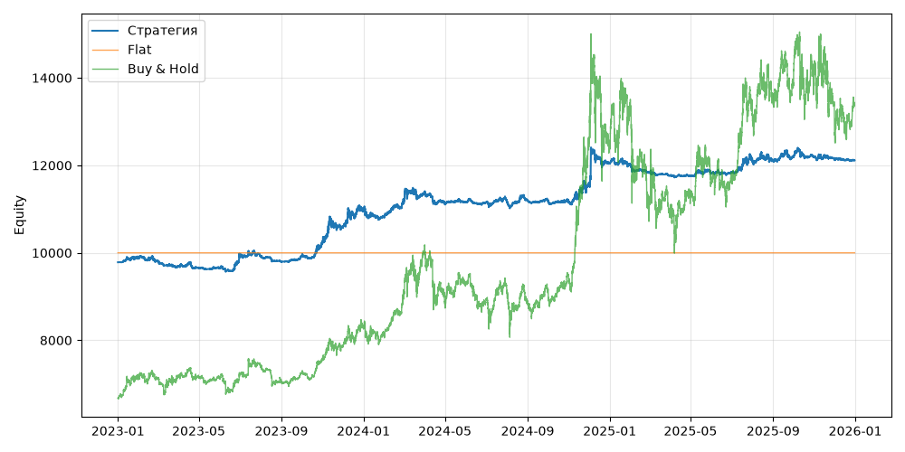

# S01 — donchian_ensemble (V0, портфель, dev 2023-01-01..2025-12-31)

Прогонов учтено (для DSR): 1

## Метрики

| Метрика | Значение |
|---|---|
| Total return | 23.82% |
| CAGR | 7.38% |
| Vol | 6.47% |
| Sharpe | 1.133 |
| Sortino | 1.992 |
| MaxDD | -5.49% |
| Calmar | 1.344 |
| Trades | 189 |
| Win rate | 10.58% |
| Profit factor | 0.224 |
| Avg trade gross, б.п. | -450.7 |
| Avg trade net, б.п. | -494.9 |
| Cost share | 62.30% |
| Exposure | 100.00% |
| Funding paid | -135.95 |
| DSR | 0.955 |
| Random percentile | — |

## Бенчмарки

| Бенчмарк | Total return | Sharpe | MaxDD |
|---|---|---|---|
| Flat | 0.00% | — | 0.00% |
| Buy & Hold | 100.40% | 0.956 | -33.42% |

## Помесячная доходность

| Месяц | Доходность |
|---|---|
| 2023-02 | -0.84% |
| 2023-03 | -1.10% |
| 2023-04 | -0.38% |
| 2023-05 | -0.06% |
| 2023-06 | 3.12% |
| 2023-07 | -0.30% |
| 2023-08 | -1.28% |
| 2023-09 | 1.23% |
| 2023-10 | 3.37% |
| 2023-11 | 3.17% |
| 2023-12 | 3.62% |
| 2024-01 | -1.32% |
| 2024-02 | 3.05% |
| 2024-03 | 2.29% |
| 2024-04 | -2.36% |
| 2024-05 | 0.21% |
| 2024-06 | -0.09% |
| 2024-07 | 0.25% |
| 2024-08 | 0.24% |
| 2024-09 | -0.14% |
| 2024-10 | -0.21% |
| 2024-11 | 3.65% |
| 2024-12 | 4.09% |
| 2025-01 | -0.23% |
| 2025-02 | -1.47% |
| 2025-03 | -0.57% |
| 2025-04 | -0.06% |
| 2025-05 | 0.51% |
| 2025-06 | 0.17% |
| 2025-07 | 2.23% |
| 2025-08 | 0.01% |
| 2025-09 | 0.67% |
| 2025-10 | 0.06% |
| 2025-11 | -0.35% |
| 2025-12 | -0.33% |

**Статистическая оговорка.** Окно ~9 месяцев короткое: стандартная ошибка годового Шарпа ≈ √((1 + SR²/2) / T), при T ≈ 0.73 это около ±1.2. Шарп 1 на таком окне почти неотличим от нуля (01_PROTOCOL.md, раздел 8).
