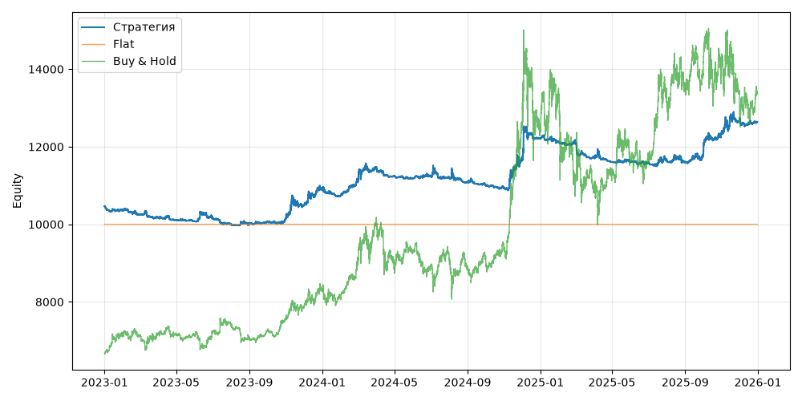

# S01b — donchian_ensemble_mirror_short (V0, портфель, dev 2023-01-01..2025-12-31)

Прогонов учтено (для DSR): 1

## Метрики

| Метрика | Значение |
|---|---|
| Total return | 20.80% |
| CAGR | 6.50% |
| Vol | 6.69% |
| Sharpe | 0.979 |
| Sortino | 1.692 |
| MaxDD | -8.26% |
| Calmar | 0.787 |
| Trades | 138 |
| Win rate | 15.94% |
| Profit factor | 0.338 |
| Avg trade gross, б.п. | -295.8 |
| Avg trade net, б.п. | -403.1 |
| Cost share | 49.33% |
| Exposure | 100.00% |
| Funding paid | -120.07 |
| DSR | 0.905 |
| Random percentile | — |

## Бенчмарки

| Бенчмарк | Total return | Sharpe | MaxDD |
|---|---|---|---|
| Flat | 0.00% | — | 0.00% |
| Buy & Hold | 100.40% | 0.956 | -33.42% |

## Помесячная доходность

| Месяц | Доходность |
|---|---|
| 2023-02 | -1.09% |
| 2023-03 | -0.68% |
| 2023-04 | -0.64% |
| 2023-05 | -0.36% |
| 2023-06 | 0.81% |
| 2023-07 | -1.59% |
| 2023-08 | 0.17% |
| 2023-09 | 0.41% |
| 2023-10 | 1.02% |
| 2023-11 | 3.11% |
| 2023-12 | 4.04% |
| 2024-01 | -1.57% |
| 2024-02 | 3.37% |
| 2024-03 | 3.53% |
| 2024-04 | -2.02% |
| 2024-05 | -0.59% |
| 2024-06 | 0.47% |
| 2024-07 | -0.30% |
| 2024-08 | -1.07% |
| 2024-09 | -0.68% |
| 2024-10 | -0.65% |
| 2024-11 | 6.71% |
| 2024-12 | 4.60% |
| 2025-01 | -0.67% |
| 2025-02 | -0.31% |
| 2025-03 | -2.96% |
| 2025-04 | -1.06% |
| 2025-05 | -0.03% |
| 2025-06 | -0.25% |
| 2025-07 | 0.60% |
| 2025-08 | -0.35% |
| 2025-09 | 1.49% |
| 2025-10 | 4.97% |
| 2025-11 | 2.45% |
| 2025-12 | -0.22% |

**Статистическая оговорка.** Окно ~9 месяцев короткое: стандартная ошибка годового Шарпа ≈ √((1 + SR²/2) / T), при T ≈ 0.73 это около ±1.2. Шарп 1 на таком окне почти неотличим от нуля (01_PROTOCOL.md, раздел 8).
