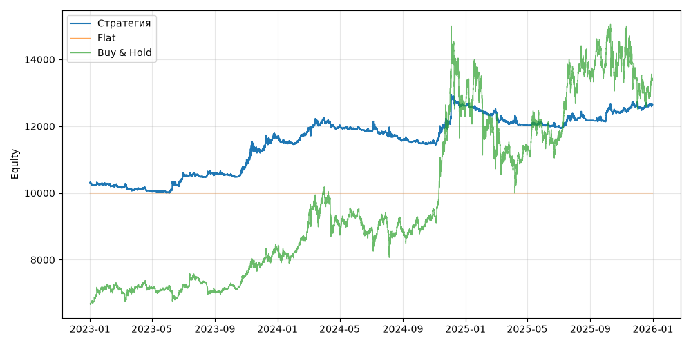

# S01b+BtcRegimeFilter (V0, портфель, dev 2023-01-01..2025-12-31)

Прогонов учтено (для DSR): 1

## Метрики

| Метрика | Значение |
|---|---|
| Total return | 22.61% |
| CAGR | 7.03% |
| Vol | 6.74% |
| Sharpe | 1.047 |
| Sortino | 1.774 |
| MaxDD | -7.81% |
| Calmar | 0.900 |
| Trades | 420 |
| Win rate | 17.62% |
| Profit factor | 0.534 |
| Avg trade gross, б.п. | -359.4 |
| Avg trade net, б.п. | -402.2 |
| Cost share | 18.10% |
| Exposure | 100.00% |
| Funding paid | -157.43 |
| DSR | 0.926 |
| Random percentile | — |

## Бенчмарки

| Бенчмарк | Total return | Sharpe | MaxDD |
|---|---|---|---|
| Flat | 0.00% | — | 0.00% |
| Buy & Hold | 100.40% | 0.956 | -33.42% |

## Помесячная доходность

| Месяц | Доходность |
|---|---|
| 2023-02 | -0.77% |
| 2023-03 | -0.49% |
| 2023-04 | -0.68% |
| 2023-05 | -0.42% |
| 2023-06 | 5.53% |
| 2023-07 | -0.52% |
| 2023-08 | 0.60% |
| 2023-09 | -0.42% |
| 2023-10 | 3.38% |
| 2023-11 | 3.30% |
| 2023-12 | 3.54% |
| 2024-01 | -1.63% |
| 2024-02 | 3.46% |
| 2024-03 | 3.43% |
| 2024-04 | -2.08% |
| 2024-05 | -0.74% |
| 2024-06 | -0.54% |
| 2024-07 | -0.76% |
| 2024-08 | -1.63% |
| 2024-09 | -0.36% |
| 2024-10 | -0.17% |
| 2024-11 | 5.25% |
| 2024-12 | 4.15% |
| 2025-01 | -1.21% |
| 2025-02 | -0.34% |
| 2025-03 | -2.46% |
| 2025-04 | -0.67% |
| 2025-05 | 0.09% |
| 2025-06 | -0.32% |
| 2025-07 | 1.98% |
| 2025-08 | -0.56% |
| 2025-09 | -0.30% |
| 2025-10 | 2.35% |
| 2025-11 | 1.66% |
| 2025-12 | 0.08% |

**Статистическая оговорка.** Окно ~9 месяцев короткое: стандартная ошибка годового Шарпа ≈ √((1 + SR²/2) / T), при T ≈ 0.73 это около ±1.2. Шарп 1 на таком окне почти неотличим от нуля (01_PROTOCOL.md, раздел 8).
