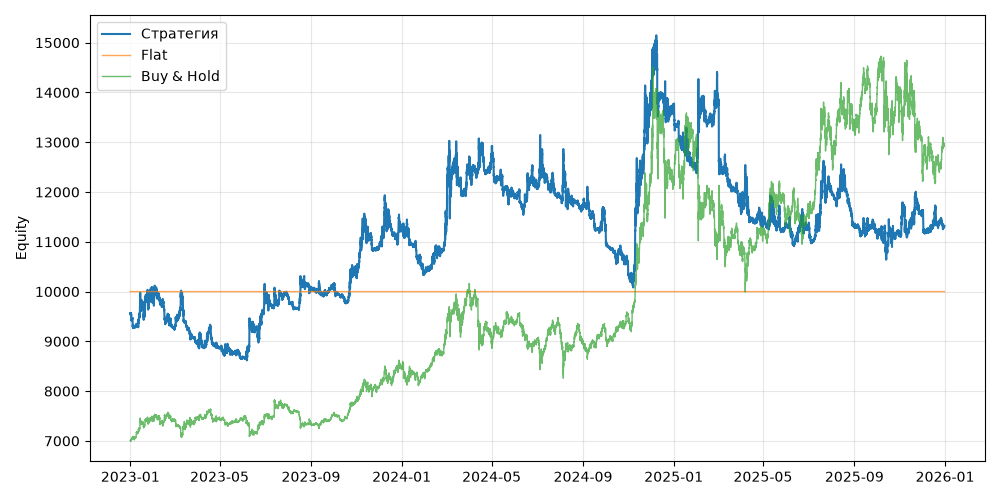

# S02 — tsmom (V0, портфель, dev 2023-01-01..2025-12-31)

Прогонов учтено (для DSR): 1

## Метрики

| Метрика | Значение |
|---|---|
| Total return | 18.35% |
| CAGR | 5.78% |
| Vol | 23.49% |
| Sharpe | 0.364 |
| Sortino | 0.526 |
| MaxDD | -29.76% |
| Calmar | 0.194 |
| Trades | 9 |
| Win rate | 22.22% |
| Profit factor | 0.086 |
| Avg trade gross, б.п. | -224.4 |
| Avg trade net, б.п. | -296.4 |
| Cost share | 1644.26% |
| Exposure | 100.00% |
| Funding paid | -385.16 |
| DSR | 0.543 |
| Random percentile | — |

## Бенчмарки

| Бенчмарк | Total return | Sharpe | MaxDD |
|---|---|---|---|
| Flat | 0.00% | — | 0.00% |
| Buy & Hold | 84.48% | 0.902 | -31.12% |

## Помесячная доходность

| Месяц | Доходность |
|---|---|
| 2023-02 | -6.15% |
| 2023-03 | -3.31% |
| 2023-04 | -1.16% |
| 2023-05 | -2.26% |
| 2023-06 | 15.57% |
| 2023-07 | -1.23% |
| 2023-08 | 1.81% |
| 2023-09 | 0.38% |
| 2023-10 | 2.94% |
| 2023-11 | 4.37% |
| 2023-12 | 3.36% |
| 2024-01 | -7.68% |
| 2024-02 | 8.36% |
| 2024-03 | 12.99% |
| 2024-04 | 0.16% |
| 2024-05 | -6.10% |
| 2024-06 | 1.17% |
| 2024-07 | -1.42% |
| 2024-08 | -1.95% |
| 2024-09 | -3.99% |
| 2024-10 | -7.59% |
| 2024-11 | 33.48% |
| 2024-12 | -0.58% |
| 2025-01 | -8.89% |
| 2025-02 | 11.01% |
| 2025-03 | -15.26% |
| 2025-04 | -3.33% |
| 2025-05 | -0.67% |
| 2025-06 | -0.35% |
| 2025-07 | 6.40% |
| 2025-08 | -5.67% |
| 2025-09 | -1.11% |
| 2025-10 | -0.64% |
| 2025-11 | 4.02% |
| 2025-12 | -2.22% |

**Статистическая оговорка.** Окно ~9 месяцев короткое: стандартная ошибка годового Шарпа ≈ √((1 + SR²/2) / T), при T ≈ 0.73 это около ±1.2. Шарп 1 на таком окне почти неотличим от нуля (01_PROTOCOL.md, раздел 8).
