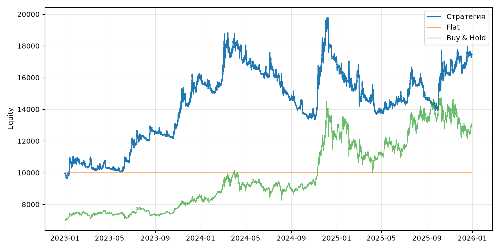

# S02+BtcRegimeFilter (V0, портфель, dev 2023-01-01..2025-12-31)

Прогонов учтено (для DSR): 1

## Метрики

| Метрика | Значение |
|---|---|
| Total return | 75.46% |
| CAGR | 20.61% |
| Vol | 25.78% |
| Sharpe | 0.863 |
| Sortino | 1.276 |
| MaxDD | -30.92% |
| Calmar | 0.667 |
| Trades | 741 |
| Win rate | 19.57% |
| Profit factor | 0.369 |
| Avg trade gross, б.п. | -248.2 |
| Avg trade net, б.п. | -281.4 |
| Cost share | 24.94% |
| Exposure | 100.00% |
| Funding paid | -856.21 |
| DSR | 0.832 |
| Random percentile | — |

## Бенчмарки

| Бенчмарк | Total return | Sharpe | MaxDD |
|---|---|---|---|
| Flat | 0.00% | — | 0.00% |
| Buy & Hold | 84.48% | 0.902 | -31.12% |

## Помесячная доходность

| Месяц | Доходность |
|---|---|
| 2023-02 | -3.26% |
| 2023-03 | 0.30% |
| 2023-04 | -1.16% |
| 2023-05 | -1.85% |
| 2023-06 | 19.55% |
| 2023-07 | 1.77% |
| 2023-08 | 2.58% |
| 2023-09 | -1.52% |
| 2023-10 | 7.41% |
| 2023-11 | 7.64% |
| 2023-12 | 11.00% |
| 2024-01 | -5.40% |
| 2024-02 | 7.81% |
| 2024-03 | 15.89% |
| 2024-04 | -5.99% |
| 2024-05 | -6.06% |
| 2024-06 | -3.48% |
| 2024-07 | -1.68% |
| 2024-08 | -7.08% |
| 2024-09 | -3.95% |
| 2024-10 | -3.07% |
| 2024-11 | 34.37% |
| 2024-12 | -5.69% |
| 2025-01 | -8.67% |
| 2025-02 | 2.21% |
| 2025-03 | -9.54% |
| 2025-04 | -5.01% |
| 2025-05 | 2.70% |
| 2025-06 | 2.88% |
| 2025-07 | 6.81% |
| 2025-08 | -6.25% |
| 2025-09 | -4.96% |
| 2025-10 | 16.09% |
| 2025-11 | 6.03% |
| 2025-12 | 1.80% |

**Статистическая оговорка.** Окно ~9 месяцев короткое: стандартная ошибка годового Шарпа ≈ √((1 + SR²/2) / T), при T ≈ 0.73 это около ±1.2. Шарп 1 на таком окне почти неотличим от нуля (01_PROTOCOL.md, раздел 8).
