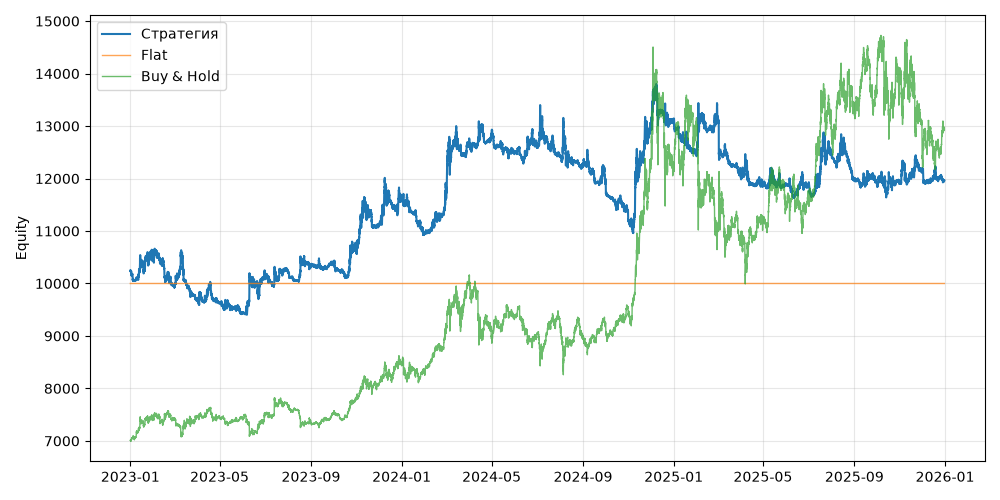

# S02+VolTarget (V0, портфель, dev 2023-01-01..2025-12-31)

Прогонов учтено (для DSR): 1

## Метрики

| Метрика | Значение |
|---|---|
| Total return | 16.76% |
| CAGR | 5.30% |
| Vol | 15.00% |
| Sharpe | 0.426 |
| Sortino | 0.635 |
| MaxDD | -18.21% |
| Calmar | 0.291 |
| Trades | 919 |
| Win rate | 17.63% |
| Profit factor | 0.118 |
| Avg trade gross, б.п. | -382.9 |
| Avg trade net, б.п. | -413.7 |
| Cost share | 67.26% |
| Exposure | 100.00% |
| Funding paid | -229.66 |
| DSR | 0.587 |
| Random percentile | — |

## Бенчмарки

| Бенчмарк | Total return | Sharpe | MaxDD |
|---|---|---|---|
| Flat | 0.00% | — | 0.00% |
| Buy & Hold | 84.48% | 0.902 | -31.12% |

## Помесячная доходность

| Месяц | Доходность |
|---|---|
| 2023-02 | -5.15% |
| 2023-03 | -2.76% |
| 2023-04 | -0.57% |
| 2023-05 | -2.02% |
| 2023-06 | 8.07% |
| 2023-07 | 0.26% |
| 2023-08 | 1.29% |
| 2023-09 | 0.35% |
| 2023-10 | 2.80% |
| 2023-11 | 3.93% |
| 2023-12 | 4.33% |
| 2024-01 | -5.49% |
| 2024-02 | 6.38% |
| 2024-03 | 9.51% |
| 2024-04 | 0.62% |
| 2024-05 | -2.55% |
| 2024-06 | 0.73% |
| 2024-07 | -1.31% |
| 2024-08 | -1.61% |
| 2024-09 | -2.81% |
| 2024-10 | -5.72% |
| 2024-11 | 16.01% |
| 2024-12 | 0.96% |
| 2025-01 | -4.74% |
| 2025-02 | 5.15% |
| 2025-03 | -8.03% |
| 2025-04 | -1.77% |
| 2025-05 | -0.03% |
| 2025-06 | -0.18% |
| 2025-07 | 5.00% |
| 2025-08 | -3.81% |
| 2025-09 | -0.43% |
| 2025-10 | -0.13% |
| 2025-11 | 2.04% |
| 2025-12 | -1.59% |

**Статистическая оговорка.** Окно ~9 месяцев короткое: стандартная ошибка годового Шарпа ≈ √((1 + SR²/2) / T), при T ≈ 0.73 это около ±1.2. Шарп 1 на таком окне почти неотличим от нуля (01_PROTOCOL.md, раздел 8).
