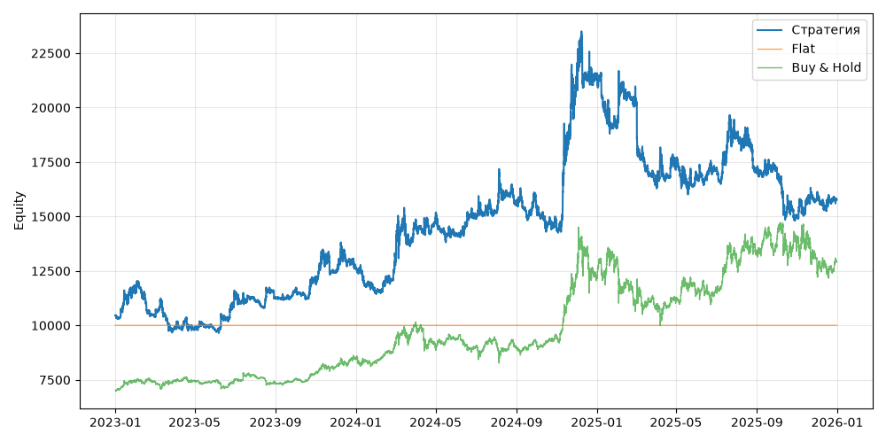

# S03 — price_vs_sma (V0, портфель, dev 2023-01-01..2025-12-31)

Прогонов учтено (для DSR): 1

## Метрики

| Метрика | Значение |
|---|---|
| Total return | 50.93% |
| CAGR | 14.71% |
| Vol | 27.17% |
| Sharpe | 0.645 |
| Sortino | 0.941 |
| MaxDD | -36.96% |
| Calmar | 0.398 |
| Trades | 808 |
| Win rate | 26.49% |
| Profit factor | 1.145 |
| Avg trade gross, б.п. | 88.5 |
| Avg trade net, б.п. | 73.0 |
| Cost share | 4.80% |
| Exposure | 100.00% |
| Funding paid | -561.87 |
| DSR | 0.724 |
| Random percentile | — |

## Бенчмарки

| Бенчмарк | Total return | Sharpe | MaxDD |
|---|---|---|---|
| Flat | 0.00% | — | 0.00% |
| Buy & Hold | 84.48% | 0.902 | -31.12% |

## Помесячная доходность

| Месяц | Доходность |
|---|---|
| 2023-02 | -10.49% |
| 2023-03 | -5.54% |
| 2023-04 | -0.59% |
| 2023-05 | -0.59% |
| 2023-06 | 16.46% |
| 2023-07 | -2.68% |
| 2023-08 | 1.32% |
| 2023-09 | 2.84% |
| 2023-10 | 4.30% |
| 2023-11 | 3.50% |
| 2023-12 | 1.08% |
| 2024-01 | -9.40% |
| 2024-02 | 11.77% |
| 2024-03 | 15.85% |
| 2024-04 | 0.47% |
| 2024-05 | -4.74% |
| 2024-06 | 5.32% |
| 2024-07 | 1.48% |
| 2024-08 | 2.54% |
| 2024-09 | -1.11% |
| 2024-10 | -5.98% |
| 2024-11 | 46.02% |
| 2024-12 | 1.89% |
| 2025-01 | -10.63% |
| 2025-02 | 5.64% |
| 2025-03 | -18.26% |
| 2025-04 | 4.51% |
| 2025-05 | -3.01% |
| 2025-06 | 1.90% |
| 2025-07 | 8.68% |
| 2025-08 | -8.00% |
| 2025-09 | 0.03% |
| 2025-10 | -12.96% |
| 2025-11 | 6.04% |
| 2025-12 | -0.40% |

**Статистическая оговорка.** Окно ~9 месяцев короткое: стандартная ошибка годового Шарпа ≈ √((1 + SR²/2) / T), при T ≈ 0.73 это около ±1.2. Шарп 1 на таком окне почти неотличим от нуля (01_PROTOCOL.md, раздел 8).
