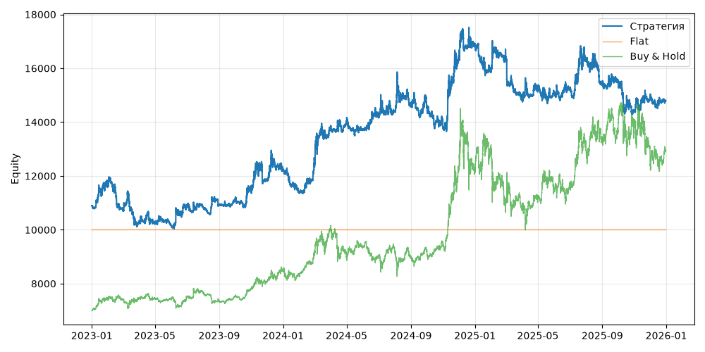

# S03+VolTarget (V0, портфель, dev 2023-01-01..2025-12-31)

Прогонов учтено (для DSR): 1

## Метрики

| Метрика | Значение |
|---|---|
| Total return | 35.77% |
| CAGR | 10.73% |
| Vol | 16.98% |
| Sharpe | 0.690 |
| Sortino | 1.012 |
| MaxDD | -18.41% |
| Calmar | 0.583 |
| Trades | 808 |
| Win rate | 26.11% |
| Profit factor | 0.888 |
| Avg trade gross, б.п. | -23.2 |
| Avg trade net, б.п. | -37.3 |
| Cost share | 6.14% |
| Exposure | 100.00% |
| Funding paid | -252.01 |
| DSR | 0.750 |
| Random percentile | — |

## Бенчмарки

| Бенчмарк | Total return | Sharpe | MaxDD |
|---|---|---|---|
| Flat | 0.00% | — | 0.00% |
| Buy & Hold | 84.48% | 0.902 | -31.12% |

## Помесячная доходность

| Месяц | Доходность |
|---|---|
| 2023-02 | -8.01% |
| 2023-03 | -4.63% |
| 2023-04 | -0.35% |
| 2023-05 | -0.97% |
| 2023-06 | 6.88% |
| 2023-07 | -0.32% |
| 2023-08 | 0.86% |
| 2023-09 | 1.54% |
| 2023-10 | 3.71% |
| 2023-11 | 3.29% |
| 2023-12 | 2.78% |
| 2024-01 | -7.01% |
| 2024-02 | 8.84% |
| 2024-03 | 12.05% |
| 2024-04 | 1.17% |
| 2024-05 | -2.03% |
| 2024-06 | 3.51% |
| 2024-07 | 1.17% |
| 2024-08 | 1.54% |
| 2024-09 | -0.51% |
| 2024-10 | -4.77% |
| 2024-11 | 18.57% |
| 2024-12 | 2.99% |
| 2025-01 | -5.70% |
| 2025-02 | 2.81% |
| 2025-03 | -9.06% |
| 2025-04 | 2.20% |
| 2025-05 | -1.05% |
| 2025-06 | 1.21% |
| 2025-07 | 6.81% |
| 2025-08 | -5.06% |
| 2025-09 | 0.37% |
| 2025-10 | -7.35% |
| 2025-11 | 3.38% |
| 2025-12 | -0.52% |

**Статистическая оговорка.** Окно ~9 месяцев короткое: стандартная ошибка годового Шарпа ≈ √((1 + SR²/2) / T), при T ≈ 0.73 это около ±1.2. Шарп 1 на таком окне почти неотличим от нуля (01_PROTOCOL.md, раздел 8).
