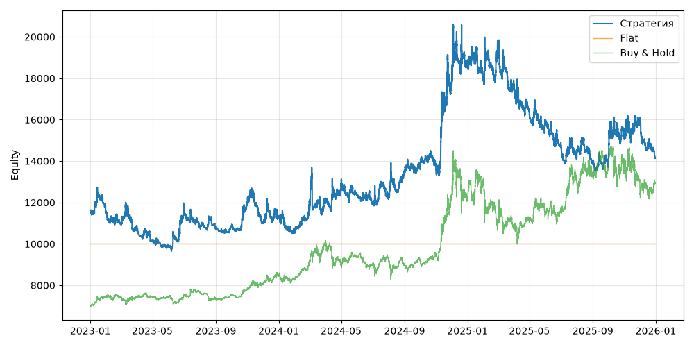

# S04 — turtle_system1 (V0, портфель, dev 2023-01-01..2025-12-31)

Прогонов учтено (для DSR): 1

## Метрики

| Метрика | Значение |
|---|---|
| Total return | 22.38% |
| CAGR | 6.96% |
| Vol | 26.79% |
| Sharpe | 0.386 |
| Sortino | 0.594 |
| MaxDD | -34.32% |
| Calmar | 0.203 |
| Trades | 1524 |
| Win rate | 33.53% |
| Profit factor | 1.100 |
| Avg trade gross, б.п. | 46.1 |
| Avg trade net, б.п. | 37.9 |
| Cost share | 4.06% |
| Exposure | 100.00% |
| Funding paid | -590.48 |
| DSR | 0.560 |
| Random percentile | — |

## Бенчмарки

| Бенчмарк | Total return | Sharpe | MaxDD |
|---|---|---|---|
| Flat | 0.00% | — | 0.00% |
| Buy & Hold | 84.48% | 0.902 | -31.12% |

## Помесячная доходность

| Месяц | Доходность |
|---|---|
| 2023-02 | -4.70% |
| 2023-03 | -1.43% |
| 2023-04 | -6.74% |
| 2023-05 | -2.23% |
| 2023-06 | 18.50% |
| 2023-07 | -7.58% |
| 2023-08 | -1.11% |
| 2023-09 | 1.11% |
| 2023-10 | 10.63% |
| 2023-11 | -8.24% |
| 2023-12 | 2.75% |
| 2024-01 | -6.65% |
| 2024-02 | 10.88% |
| 2024-03 | 4.18% |
| 2024-04 | 5.48% |
| 2024-05 | -3.71% |
| 2024-06 | -3.79% |
| 2024-07 | 2.67% |
| 2024-08 | 9.64% |
| 2024-09 | 2.47% |
| 2024-10 | -1.21% |
| 2024-11 | 30.82% |
| 2024-12 | 6.26% |
| 2025-01 | -5.03% |
| 2025-02 | 7.02% |
| 2025-03 | -7.65% |
| 2025-04 | -8.22% |
| 2025-05 | -2.58% |
| 2025-06 | -6.91% |
| 2025-07 | -2.31% |
| 2025-08 | -3.03% |
| 2025-09 | -1.28% |
| 2025-10 | 10.38% |
| 2025-11 | 3.58% |
| 2025-12 | -10.12% |

**Статистическая оговорка.** Окно ~9 месяцев короткое: стандартная ошибка годового Шарпа ≈ √((1 + SR²/2) / T), при T ≈ 0.73 это около ±1.2. Шарп 1 на таком окне почти неотличим от нуля (01_PROTOCOL.md, раздел 8).
