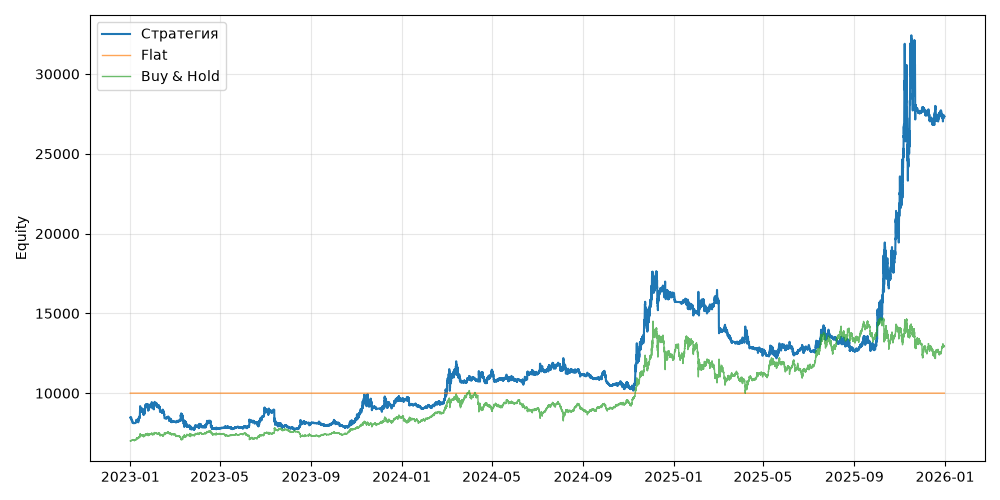

# S05 — bollinger_breakout (V0, портфель, dev 2023-01-01..2025-12-31)

Прогонов учтено (для DSR): 1

## Метрики

| Метрика | Значение |
|---|---|
| Total return | 223.02% |
| CAGR | 47.82% |
| Vol | 34.67% |
| Sharpe | 1.302 |
| Sortino | 2.034 |
| MaxDD | -30.95% |
| Calmar | 1.545 |
| Trades | 345 |
| Win rate | 35.94% |
| Profit factor | 1.811 |
| Avg trade gross, б.п. | 485.3 |
| Avg trade net, б.п. | 467.6 |
| Cost share | 1.64% |
| Exposure | 100.00% |
| Funding paid | -295.29 |
| DSR | 0.960 |
| Random percentile | — |

## Бенчмарки

| Бенчмарк | Total return | Sharpe | MaxDD |
|---|---|---|---|
| Flat | 0.00% | — | 0.00% |
| Buy & Hold | 84.48% | 0.902 | -31.12% |

## Помесячная доходность

| Месяц | Доходность |
|---|---|
| 2023-02 | -10.67% |
| 2023-03 | -3.01% |
| 2023-04 | -2.23% |
| 2023-05 | 0.77% |
| 2023-06 | 14.69% |
| 2023-07 | -12.36% |
| 2023-08 | 3.03% |
| 2023-09 | 0.16% |
| 2023-10 | 3.52% |
| 2023-11 | 7.23% |
| 2023-12 | 5.60% |
| 2024-01 | -4.66% |
| 2024-02 | 8.71% |
| 2024-03 | 12.03% |
| 2024-04 | 2.13% |
| 2024-05 | -3.97% |
| 2024-06 | 3.12% |
| 2024-07 | 4.79% |
| 2024-08 | -4.91% |
| 2024-09 | -1.56% |
| 2024-10 | -5.14% |
| 2024-11 | 50.54% |
| 2024-12 | 3.60% |
| 2025-01 | -7.45% |
| 2025-02 | 4.70% |
| 2025-03 | -15.72% |
| 2025-04 | -5.83% |
| 2025-05 | 2.34% |
| 2025-06 | 0.34% |
| 2025-07 | 5.55% |
| 2025-08 | -6.41% |
| 2025-09 | 4.26% |
| 2025-10 | 69.64% |
| 2025-11 | 23.64% |
| 2025-12 | -1.41% |

**Статистическая оговорка.** Окно ~9 месяцев короткое: стандартная ошибка годового Шарпа ≈ √((1 + SR²/2) / T), при T ≈ 0.73 это около ±1.2. Шарп 1 на таком окне почти неотличим от нуля (01_PROTOCOL.md, раздел 8).
