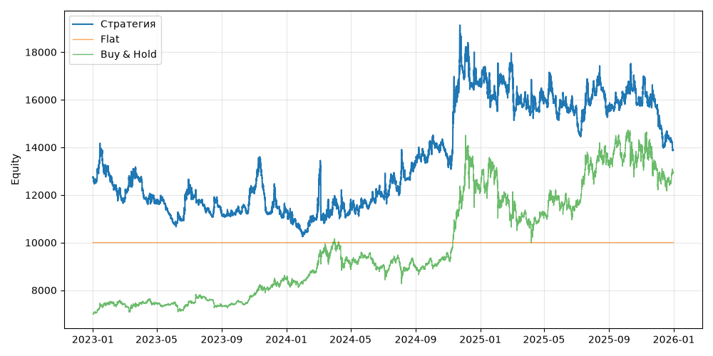

# S06 — supertrend (V0, портфель, dev 2023-01-01..2025-12-31)

Прогонов учтено (для DSR): 1

## Метрики

| Метрика | Значение |
|---|---|
| Total return | 9.09% |
| CAGR | 2.94% |
| Vol | 28.56% |
| Sharpe | 0.250 |
| Sortino | 0.365 |
| MaxDD | -27.66% |
| Calmar | 0.106 |
| Trades | 963 |
| Win rate | 39.46% |
| Profit factor | 1.089 |
| Avg trade gross, б.п. | 60.4 |
| Avg trade net, б.п. | 47.4 |
| Cost share | 4.22% |
| Exposure | 100.00% |
| Funding paid | -359.39 |
| DSR | 0.465 |
| Random percentile | — |

## Бенчмарки

| Бенчмарк | Total return | Sharpe | MaxDD |
|---|---|---|---|
| Flat | 0.00% | — | 0.00% |
| Buy & Hold | 84.48% | 0.902 | -31.12% |

## Помесячная доходность

| Месяц | Доходность |
|---|---|
| 2023-02 | -7.91% |
| 2023-03 | 7.19% |
| 2023-04 | -7.57% |
| 2023-05 | -7.36% |
| 2023-06 | 14.60% |
| 2023-07 | -8.93% |
| 2023-08 | -1.69% |
| 2023-09 | 2.03% |
| 2023-10 | 7.11% |
| 2023-11 | -7.55% |
| 2023-12 | 0.41% |
| 2024-01 | -9.38% |
| 2024-02 | 11.41% |
| 2024-03 | 4.50% |
| 2024-04 | -3.28% |
| 2024-05 | -0.23% |
| 2024-06 | 3.66% |
| 2024-07 | 1.13% |
| 2024-08 | 10.00% |
| 2024-09 | 4.62% |
| 2024-10 | -4.58% |
| 2024-11 | 28.10% |
| 2024-12 | -0.80% |
| 2025-01 | -6.38% |
| 2025-02 | 10.98% |
| 2025-03 | -9.04% |
| 2025-04 | 0.17% |
| 2025-05 | -1.12% |
| 2025-06 | -1.04% |
| 2025-07 | 4.52% |
| 2025-08 | -4.02% |
| 2025-09 | 1.37% |
| 2025-10 | -0.20% |
| 2025-11 | -1.32% |
| 2025-12 | -11.19% |

**Статистическая оговорка.** Окно ~9 месяцев короткое: стандартная ошибка годового Шарпа ≈ √((1 + SR²/2) / T), при T ≈ 0.73 это около ±1.2. Шарп 1 на таком окне почти неотличим от нуля (01_PROTOCOL.md, раздел 8).
