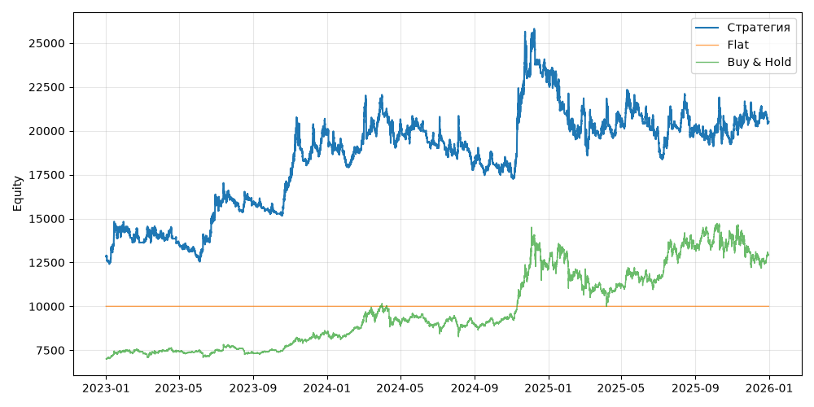

# S06+BtcRegimeFilter (V0, портфель, dev 2023-01-01..2025-12-31)

Прогонов учтено (для DSR): 1

## Метрики

| Метрика | Значение |
|---|---|
| Total return | 59.64% |
| CAGR | 16.87% |
| Vol | 28.95% |
| Sharpe | 0.686 |
| Sortino | 1.031 |
| MaxDD | -28.87% |
| Calmar | 0.584 |
| Trades | 922 |
| Win rate | 36.33% |
| Profit factor | 1.241 |
| Avg trade gross, б.п. | 109.9 |
| Avg trade net, б.п. | 98.6 |
| Cost share | 4.29% |
| Exposure | 100.00% |
| Funding paid | -991.22 |
| DSR | 0.748 |
| Random percentile | — |

## Бенчмарки

| Бенчмарк | Total return | Sharpe | MaxDD |
|---|---|---|---|
| Flat | 0.00% | — | 0.00% |
| Buy & Hold | 84.48% | 0.902 | -31.12% |

## Помесячная доходность

| Месяц | Доходность |
|---|---|
| 2023-02 | -5.14% |
| 2023-03 | 4.33% |
| 2023-04 | -4.32% |
| 2023-05 | -5.84% |
| 2023-06 | 26.23% |
| 2023-07 | -1.43% |
| 2023-08 | -0.54% |
| 2023-09 | -2.45% |
| 2023-10 | 12.03% |
| 2023-11 | 4.96% |
| 2023-12 | 8.96% |
| 2024-01 | -8.20% |
| 2024-02 | 6.15% |
| 2024-03 | 13.96% |
| 2024-04 | -7.91% |
| 2024-05 | -0.61% |
| 2024-06 | -5.33% |
| 2024-07 | -1.75% |
| 2024-08 | -3.57% |
| 2024-09 | 0.35% |
| 2024-10 | -3.93% |
| 2024-11 | 34.24% |
| 2024-12 | -0.01% |
| 2025-01 | -10.83% |
| 2025-02 | 1.54% |
| 2025-03 | -4.55% |
| 2025-04 | 0.81% |
| 2025-05 | 2.45% |
| 2025-06 | -4.10% |
| 2025-07 | 0.80% |
| 2025-08 | -0.16% |
| 2025-09 | -4.25% |
| 2025-10 | 1.64% |
| 2025-11 | 6.28% |
| 2025-12 | -1.64% |

**Статистическая оговорка.** Окно ~9 месяцев короткое: стандартная ошибка годового Шарпа ≈ √((1 + SR²/2) / T), при T ≈ 0.73 это около ±1.2. Шарп 1 на таком окне почти неотличим от нуля (01_PROTOCOL.md, раздел 8).
