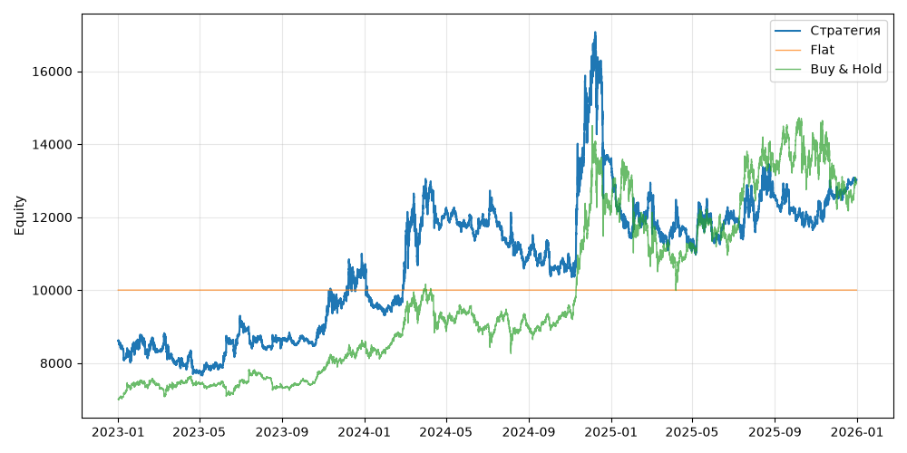

# S07 — ema_cross (V0, портфель, dev 2023-01-01..2025-12-31)

Прогонов учтено (для DSR): 1

## Метрики

| Метрика | Значение |
|---|---|
| Total return | 51.26% |
| CAGR | 14.79% |
| Vol | 29.03% |
| Sharpe | 0.624 |
| Sortino | 0.922 |
| MaxDD | -35.77% |
| Calmar | 0.414 |
| Trades | 249 |
| Win rate | 27.71% |
| Profit factor | 1.072 |
| Avg trade gross, б.п. | 129.5 |
| Avg trade net, б.п. | 96.5 |
| Cost share | 4.49% |
| Exposure | 100.00% |
| Funding paid | -530.95 |
| DSR | 0.713 |
| Random percentile | — |

## Бенчмарки

| Бенчмарк | Total return | Sharpe | MaxDD |
|---|---|---|---|
| Flat | 0.00% | — | 0.00% |
| Buy & Hold | 84.48% | 0.902 | -31.12% |

## Помесячная доходность

| Месяц | Доходность |
|---|---|
| 2023-02 | -2.94% |
| 2023-03 | -2.45% |
| 2023-04 | -3.97% |
| 2023-05 | 1.69% |
| 2023-06 | 15.91% |
| 2023-07 | -5.70% |
| 2023-08 | -0.45% |
| 2023-09 | 1.30% |
| 2023-10 | 2.35% |
| 2023-11 | 7.88% |
| 2023-12 | 7.46% |
| 2024-01 | -9.81% |
| 2024-02 | 10.85% |
| 2024-03 | 25.64% |
| 2024-04 | -6.21% |
| 2024-05 | -3.58% |
| 2024-06 | 0.17% |
| 2024-07 | -4.63% |
| 2024-08 | -2.99% |
| 2024-09 | -0.22% |
| 2024-10 | -1.84% |
| 2024-11 | 43.54% |
| 2024-12 | -11.37% |
| 2025-01 | -15.02% |
| 2025-02 | 9.17% |
| 2025-03 | -8.07% |
| 2025-04 | -3.39% |
| 2025-05 | 1.97% |
| 2025-06 | 5.26% |
| 2025-07 | 0.46% |
| 2025-08 | 3.83% |
| 2025-09 | -2.94% |
| 2025-10 | -2.61% |
| 2025-11 | 6.59% |
| 2025-12 | 3.07% |

**Статистическая оговорка.** Окно ~9 месяцев короткое: стандартная ошибка годового Шарпа ≈ √((1 + SR²/2) / T), при T ≈ 0.73 это около ±1.2. Шарп 1 на таком окне почти неотличим от нуля (01_PROTOCOL.md, раздел 8).
