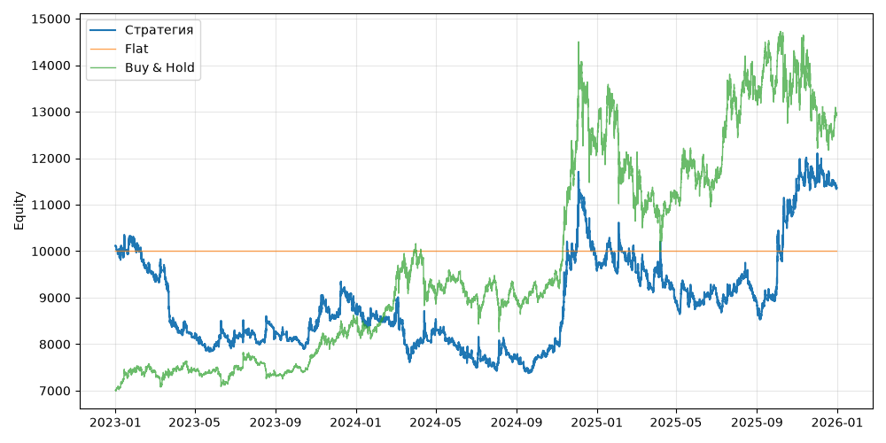

# S08 — macd_ema_filter (V0, портфель, dev 2023-01-01..2025-12-31)

Прогонов учтено (для DSR): 1

## Метрики

| Метрика | Значение |
|---|---|
| Total return | 12.28% |
| CAGR | 3.94% |
| Vol | 21.12% |
| Sharpe | 0.291 |
| Sortino | 0.477 |
| MaxDD | -28.76% |
| Calmar | 0.137 |
| Trades | 2394 |
| Win rate | 31.75% |
| Profit factor | 1.060 |
| Avg trade gross, б.п. | 21.4 |
| Avg trade net, б.п. | 14.3 |
| Cost share | 5.73% |
| Exposure | 100.00% |
| Funding paid | -317.82 |
| DSR | 0.496 |
| Random percentile | — |

## Бенчмарки

| Бенчмарк | Total return | Sharpe | MaxDD |
|---|---|---|---|
| Flat | 0.00% | — | 0.00% |
| Buy & Hold | 84.48% | 0.902 | -31.12% |

## Помесячная доходность

| Месяц | Доходность |
|---|---|
| 2023-02 | -6.58% |
| 2023-03 | -10.71% |
| 2023-04 | -3.17% |
| 2023-05 | -1.89% |
| 2023-06 | 2.83% |
| 2023-07 | -0.71% |
| 2023-08 | 1.05% |
| 2023-09 | -1.21% |
| 2023-10 | 2.61% |
| 2023-11 | 2.51% |
| 2023-12 | 1.11% |
| 2024-01 | -0.09% |
| 2024-02 | -1.98% |
| 2024-03 | -6.55% |
| 2024-04 | 5.70% |
| 2024-05 | -4.89% |
| 2024-06 | -5.71% |
| 2024-07 | -0.21% |
| 2024-08 | 2.48% |
| 2024-09 | 0.11% |
| 2024-10 | 4.77% |
| 2024-11 | 25.54% |
| 2024-12 | -4.88% |
| 2025-01 | -0.87% |
| 2025-02 | 0.10% |
| 2025-03 | 0.74% |
| 2025-04 | -7.34% |
| 2025-05 | -0.56% |
| 2025-06 | 2.21% |
| 2025-07 | 1.00% |
| 2025-08 | -3.06% |
| 2025-09 | 3.76% |
| 2025-10 | 23.13% |
| 2025-11 | 2.53% |
| 2025-12 | -2.23% |

**Статистическая оговорка.** Окно ~9 месяцев короткое: стандартная ошибка годового Шарпа ≈ √((1 + SR²/2) / T), при T ≈ 0.73 это около ±1.2. Шарп 1 на таком окне почти неотличим от нуля (01_PROTOCOL.md, раздел 8).
