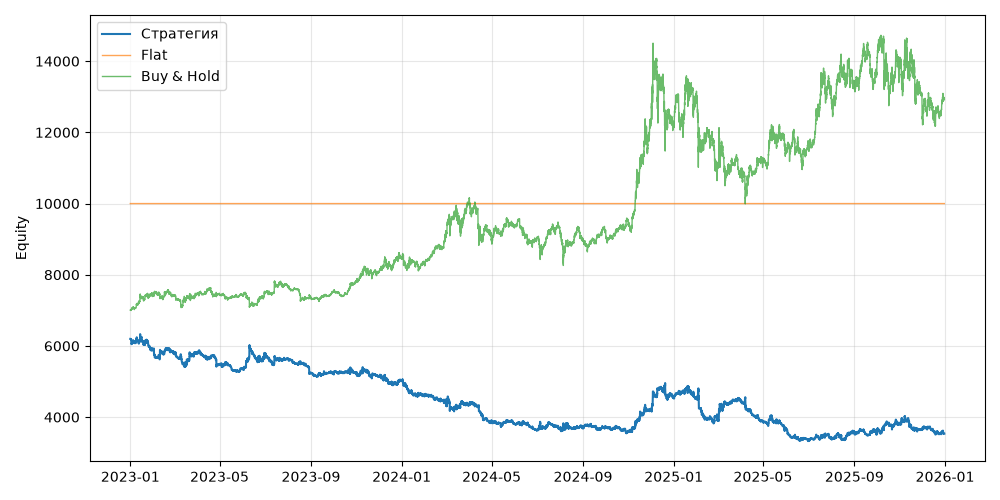

# S09 — volatility_breakout (V0, портфель, dev 2023-01-01..2025-12-31)

Прогонов учтено (для DSR): 1

## Метрики

| Метрика | Значение |
|---|---|
| Total return | -42.99% |
| CAGR | -17.08% |
| Vol | 21.50% |
| Sharpe | -0.760 |
| Sortino | -1.111 |
| MaxDD | -47.46% |
| Calmar | -0.360 |
| Trades | 5834 |
| Win rate | 45.63% |
| Profit factor | 0.878 |
| Avg trade gross, б.п. | -5.4 |
| Avg trade net, б.п. | -11.1 |
| Cost share | 8.04% |
| Exposure | 100.00% |
| Funding paid | -178.09 |
| DSR | 0.034 |
| Random percentile | — |

## Бенчмарки

| Бенчмарк | Total return | Sharpe | MaxDD |
|---|---|---|---|
| Flat | 0.00% | — | 0.00% |
| Buy & Hold | 84.48% | 0.902 | -31.12% |

## Помесячная доходность

| Месяц | Доходность |
|---|---|
| 2023-02 | -1.62% |
| 2023-03 | -0.15% |
| 2023-04 | -5.55% |
| 2023-05 | -2.26% |
| 2023-06 | 7.68% |
| 2023-07 | -2.05% |
| 2023-08 | -7.22% |
| 2023-09 | -0.23% |
| 2023-10 | 0.51% |
| 2023-11 | -2.15% |
| 2023-12 | -2.49% |
| 2024-01 | -8.15% |
| 2024-02 | -5.87% |
| 2024-03 | 0.65% |
| 2024-04 | -11.11% |
| 2024-05 | -1.82% |
| 2024-06 | -4.51% |
| 2024-07 | 0.92% |
| 2024-08 | 0.54% |
| 2024-09 | 1.65% |
| 2024-10 | -3.71% |
| 2024-11 | 16.40% |
| 2024-12 | 7.60% |
| 2025-01 | -0.31% |
| 2025-02 | -13.35% |
| 2025-03 | 14.04% |
| 2025-04 | -13.22% |
| 2025-05 | -4.90% |
| 2025-06 | -9.06% |
| 2025-07 | 1.80% |
| 2025-08 | 4.70% |
| 2025-09 | -1.05% |
| 2025-10 | 8.74% |
| 2025-11 | -4.98% |
| 2025-12 | -3.01% |

**Статистическая оговорка.** Окно ~9 месяцев короткое: стандартная ошибка годового Шарпа ≈ √((1 + SR²/2) / T), при T ≈ 0.73 это около ±1.2. Шарп 1 на таком окне почти неотличим от нуля (01_PROTOCOL.md, раздел 8).
