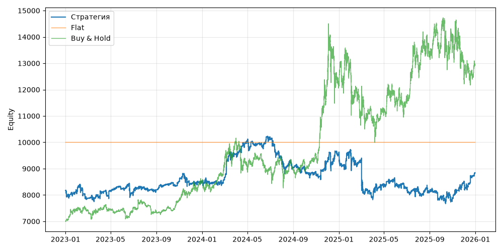

# S10 — rsi2_connors (V0, портфель, dev 2023-01-01..2025-12-31)

Прогонов учтено (для DSR): 1

## Метрики

| Метрика | Значение |
|---|---|
| Total return | 8.15% |
| CAGR | 2.65% |
| Vol | 15.06% |
| Sharpe | 0.252 |
| Sortino | 0.314 |
| MaxDD | -25.01% |
| Calmar | 0.106 |
| Trades | 3037 |
| Win rate | 63.75% |
| Profit factor | 1.005 |
| Avg trade gross, б.п. | 7.1 |
| Avg trade net, б.п. | 2.3 |
| Cost share | 7.96% |
| Exposure | 100.00% |
| Funding paid | 40.71 |
| DSR | 0.462 |
| Random percentile | — |

## Бенчмарки

| Бенчмарк | Total return | Sharpe | MaxDD |
|---|---|---|---|
| Flat | 0.00% | — | 0.00% |
| Buy & Hold | 84.48% | 0.902 | -31.12% |

## Помесячная доходность

| Месяц | Доходность |
|---|---|
| 2023-02 | -3.69% |
| 2023-03 | 0.79% |
| 2023-04 | 3.02% |
| 2023-05 | 0.76% |
| 2023-06 | -1.53% |
| 2023-07 | 1.61% |
| 2023-08 | -0.54% |
| 2023-09 | 2.62% |
| 2023-10 | 1.27% |
| 2023-11 | -1.12% |
| 2023-12 | 0.86% |
| 2024-01 | -0.34% |
| 2024-02 | 1.30% |
| 2024-03 | 11.24% |
| 2024-04 | 5.34% |
| 2024-05 | -1.00% |
| 2024-06 | 1.98% |
| 2024-07 | -7.74% |
| 2024-08 | -3.33% |
| 2024-09 | -1.13% |
| 2024-10 | -1.82% |
| 2024-11 | 5.51% |
| 2024-12 | 3.86% |
| 2025-01 | 0.89% |
| 2025-02 | -4.53% |
| 2025-03 | -14.50% |
| 2025-04 | 5.43% |
| 2025-05 | -0.00% |
| 2025-06 | -0.94% |
| 2025-07 | -0.51% |
| 2025-08 | -1.25% |
| 2025-09 | -2.17% |
| 2025-10 | -1.20% |
| 2025-11 | 8.35% |
| 2025-12 | 3.70% |

**Статистическая оговорка.** Окно ~9 месяцев короткое: стандартная ошибка годового Шарпа ≈ √((1 + SR²/2) / T), при T ≈ 0.73 это около ±1.2. Шарп 1 на таком окне почти неотличим от нуля (01_PROTOCOL.md, раздел 8).
