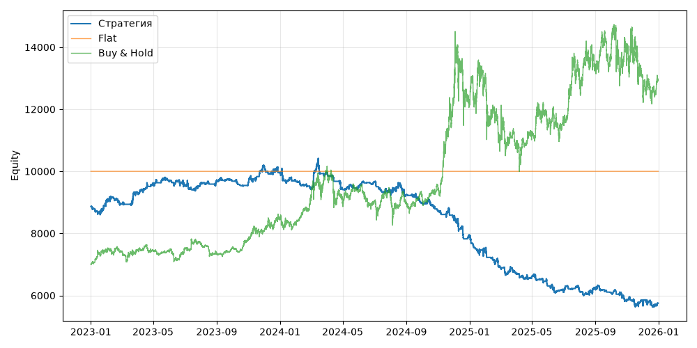

# S11 — bb_reversion_adx (V0, портфель, dev 2023-01-01..2025-12-31)

Прогонов учтено (для DSR): 1

## Метрики

| Метрика | Значение |
|---|---|
| Total return | -35.12% |
| CAGR | -13.43% |
| Vol | 10.78% |
| Sharpe | -1.283 |
| Sortino | -1.656 |
| MaxDD | -45.99% |
| Calmar | -0.292 |
| Trades | 1409 |
| Win rate | 52.45% |
| Profit factor | 0.849 |
| Avg trade gross, б.п. | -28.1 |
| Avg trade net, б.п. | -32.6 |
| Cost share | 4.89% |
| Exposure | 100.00% |
| Funding paid | 64.08 |
| DSR | 0.003 |
| Random percentile | — |

## Бенчмарки

| Бенчмарк | Total return | Sharpe | MaxDD |
|---|---|---|---|
| Flat | 0.00% | — | 0.00% |
| Buy & Hold | 84.48% | 0.902 | -31.12% |

## Помесячная доходность

| Месяц | Доходность |
|---|---|
| 2023-02 | -1.20% |
| 2023-03 | 4.06% |
| 2023-04 | 3.42% |
| 2023-05 | 0.85% |
| 2023-06 | -1.54% |
| 2023-07 | 0.71% |
| 2023-08 | 0.91% |
| 2023-09 | -0.38% |
| 2023-10 | -0.37% |
| 2023-11 | 5.50% |
| 2023-12 | -2.20% |
| 2024-01 | -2.80% |
| 2024-02 | -2.07% |
| 2024-03 | 4.62% |
| 2024-04 | -5.05% |
| 2024-05 | 1.19% |
| 2024-06 | 1.40% |
| 2024-07 | -3.90% |
| 2024-08 | -0.38% |
| 2024-09 | -2.96% |
| 2024-10 | -2.76% |
| 2024-11 | -2.10% |
| 2024-12 | -7.64% |
| 2025-01 | -4.50% |
| 2025-02 | -8.40% |
| 2025-03 | -2.99% |
| 2025-04 | -1.50% |
| 2025-05 | -4.34% |
| 2025-06 | -3.01% |
| 2025-07 | 0.57% |
| 2025-08 | 1.01% |
| 2025-09 | -2.00% |
| 2025-10 | -3.77% |
| 2025-11 | -0.45% |
| 2025-12 | -1.39% |

**Статистическая оговорка.** Окно ~9 месяцев короткое: стандартная ошибка годового Шарпа ≈ √((1 + SR²/2) / T), при T ≈ 0.73 это около ±1.2. Шарп 1 на таком окне почти неотличим от нуля (01_PROTOCOL.md, раздел 8).
