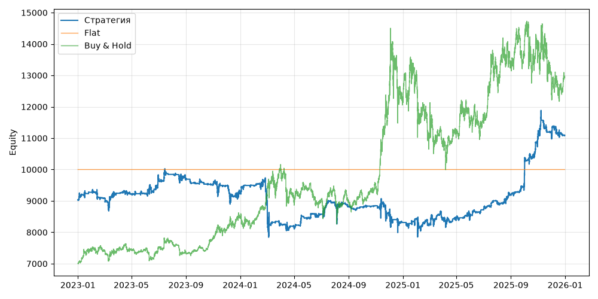

# S12 — funding_contrarian (V0, портфель, dev 2023-01-01..2025-12-31)

Прогонов учтено (для DSR): 1

## Метрики

| Метрика | Значение |
|---|---|
| Total return | 22.69% |
| CAGR | 7.06% |
| Vol | 12.72% |
| Sharpe | 0.601 |
| Sortino | 0.914 |
| MaxDD | -21.80% |
| Calmar | 0.324 |
| Trades | 1253 |
| Win rate | 52.99% |
| Profit factor | 1.088 |
| Avg trade gross, б.п. | 16.5 |
| Avg trade net, б.п. | 16.8 |
| Cost share | 2.17% |
| Exposure | 100.00% |
| Funding paid | 608.12 |
| DSR | 0.702 |
| Random percentile | — |

## Бенчмарки

| Бенчмарк | Total return | Sharpe | MaxDD |
|---|---|---|---|
| Flat | 0.00% | — | 0.00% |
| Buy & Hold | 84.48% | 0.902 | -31.12% |

## Помесячная доходность

| Месяц | Доходность |
|---|---|
| 2023-02 | -2.11% |
| 2023-03 | 1.81% |
| 2023-04 | -0.19% |
| 2023-05 | 0.04% |
| 2023-06 | 5.64% |
| 2023-07 | 0.96% |
| 2023-08 | -1.55% |
| 2023-09 | -1.51% |
| 2023-10 | -0.14% |
| 2023-11 | -0.51% |
| 2023-12 | -2.62% |
| 2024-01 | 2.66% |
| 2024-02 | -3.71% |
| 2024-03 | -9.41% |
| 2024-04 | -1.28% |
| 2024-05 | 3.39% |
| 2024-06 | 1.62% |
| 2024-07 | 4.00% |
| 2024-08 | -1.16% |
| 2024-09 | -0.11% |
| 2024-10 | 0.45% |
| 2024-11 | -3.28% |
| 2024-12 | -2.86% |
| 2025-01 | 1.50% |
| 2025-02 | -2.35% |
| 2025-03 | 2.07% |
| 2025-04 | 0.17% |
| 2025-05 | 1.01% |
| 2025-06 | 2.47% |
| 2025-07 | 3.00% |
| 2025-08 | 2.47% |
| 2025-09 | 3.10% |
| 2025-10 | 17.22% |
| 2025-11 | 0.34% |
| 2025-12 | -0.63% |

**Статистическая оговорка.** Окно ~9 месяцев короткое: стандартная ошибка годового Шарпа ≈ √((1 + SR²/2) / T), при T ≈ 0.73 это около ±1.2. Шарп 1 на таком окне почти неотличим от нуля (01_PROTOCOL.md, раздел 8).
