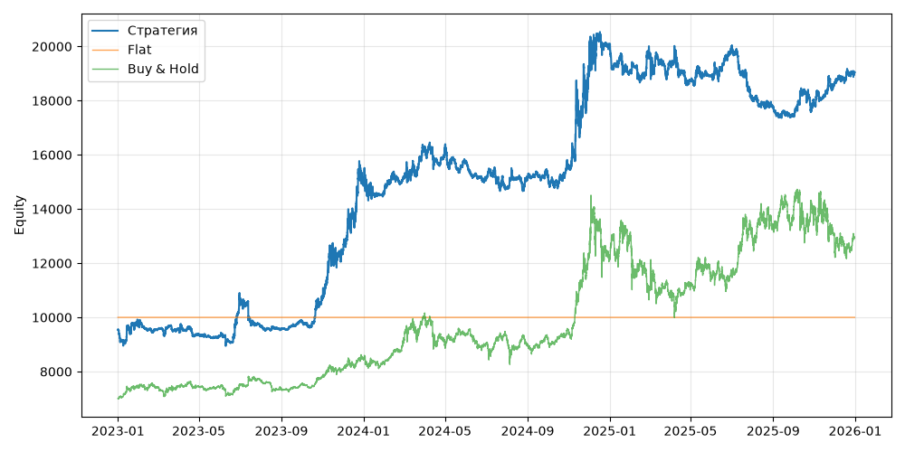

# S13 — cross_sectional_momentum (V0, портфель, dev 2023-01-01..2025-12-31)

Прогонов учтено (для DSR): 1

## Метрики

| Метрика | Значение |
|---|---|
| Total return | 99.53% |
| CAGR | 25.89% |
| Vol | 19.08% |
| Sharpe | 1.308 |
| Sortino | 2.064 |
| MaxDD | -15.46% |
| Calmar | 1.675 |
| Trades | 300 |
| Win rate | 48.00% |
| Profit factor | 1.354 |
| Avg trade gross, б.п. | 276.7 |
| Avg trade net, б.п. | 264.8 |
| Cost share | 1.78% |
| Exposure | 100.00% |
| Funding paid | -181.21 |
| DSR | 0.962 |
| Random percentile | — |

## Бенчмарки

| Бенчмарк | Total return | Sharpe | MaxDD |
|---|---|---|---|
| Flat | 0.00% | — | 0.00% |
| Buy & Hold | 84.48% | 0.902 | -31.12% |

## Помесячная доходность

| Месяц | Доходность |
|---|---|
| 2023-02 | -2.08% |
| 2023-03 | 0.29% |
| 2023-04 | -1.91% |
| 2023-05 | -0.82% |
| 2023-06 | 15.18% |
| 2023-07 | -9.82% |
| 2023-08 | -1.11% |
| 2023-09 | 3.33% |
| 2023-10 | 9.00% |
| 2023-11 | 14.56% |
| 2023-12 | 20.79% |
| 2024-01 | -2.15% |
| 2024-02 | 3.57% |
| 2024-03 | 7.67% |
| 2024-04 | -0.40% |
| 2024-05 | -2.89% |
| 2024-06 | -4.26% |
| 2024-07 | -1.89% |
| 2024-08 | 1.99% |
| 2024-09 | 0.46% |
| 2024-10 | 2.86% |
| 2024-11 | 22.41% |
| 2024-12 | 5.17% |
| 2025-01 | -4.80% |
| 2025-02 | 2.50% |
| 2025-03 | -1.16% |
| 2025-04 | -3.25% |
| 2025-05 | 0.88% |
| 2025-06 | 5.23% |
| 2025-07 | -9.23% |
| 2025-08 | -1.76% |
| 2025-09 | -1.44% |
| 2025-10 | 2.31% |
| 2025-11 | 4.47% |
| 2025-12 | 1.95% |

**Статистическая оговорка.** Окно ~9 месяцев короткое: стандартная ошибка годового Шарпа ≈ √((1 + SR²/2) / T), при T ≈ 0.73 это около ±1.2. Шарп 1 на таком окне почти неотличим от нуля (01_PROTOCOL.md, раздел 8).
